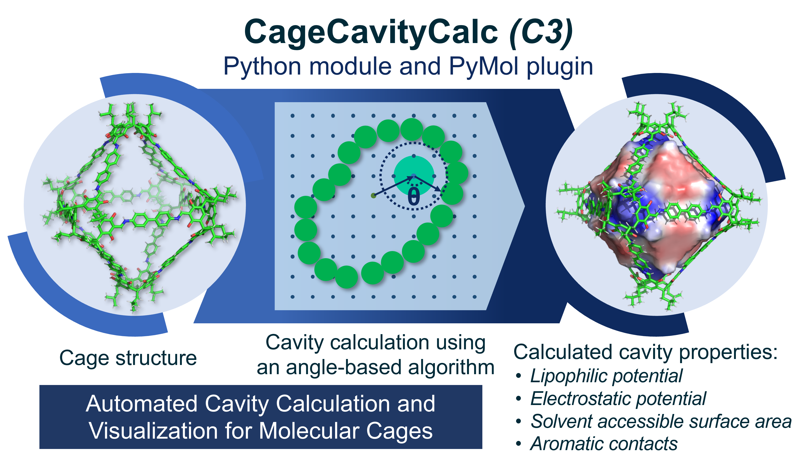
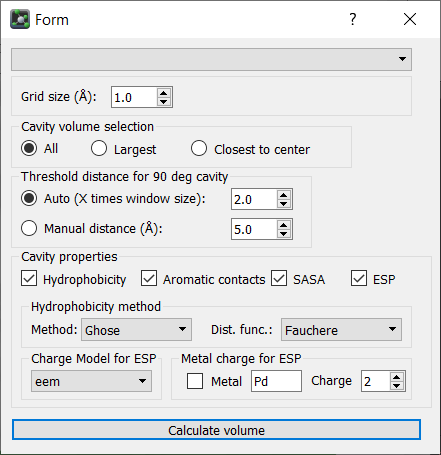
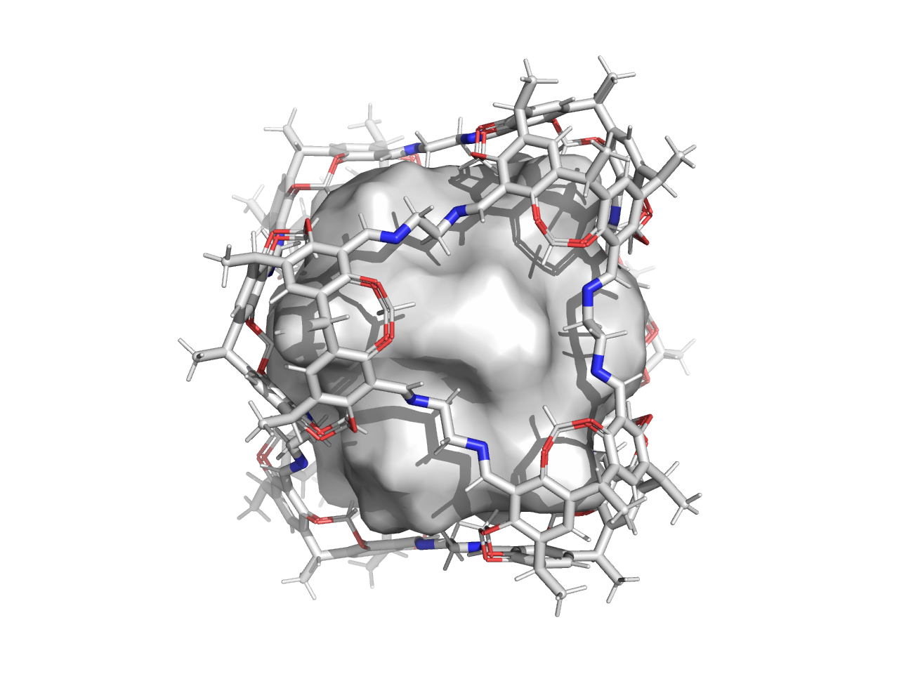
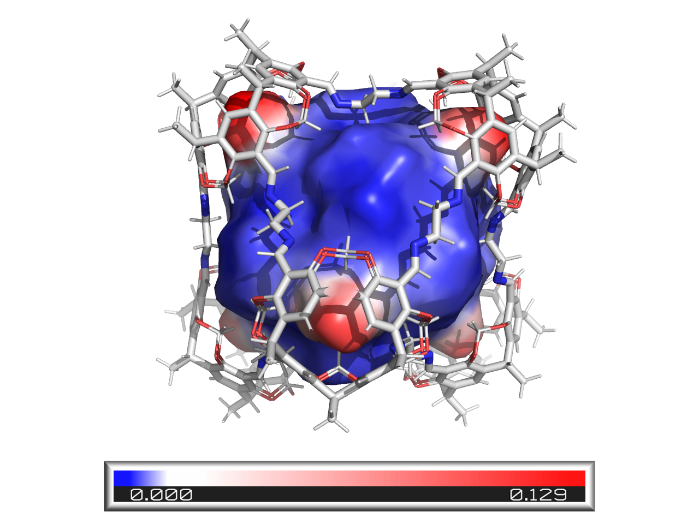
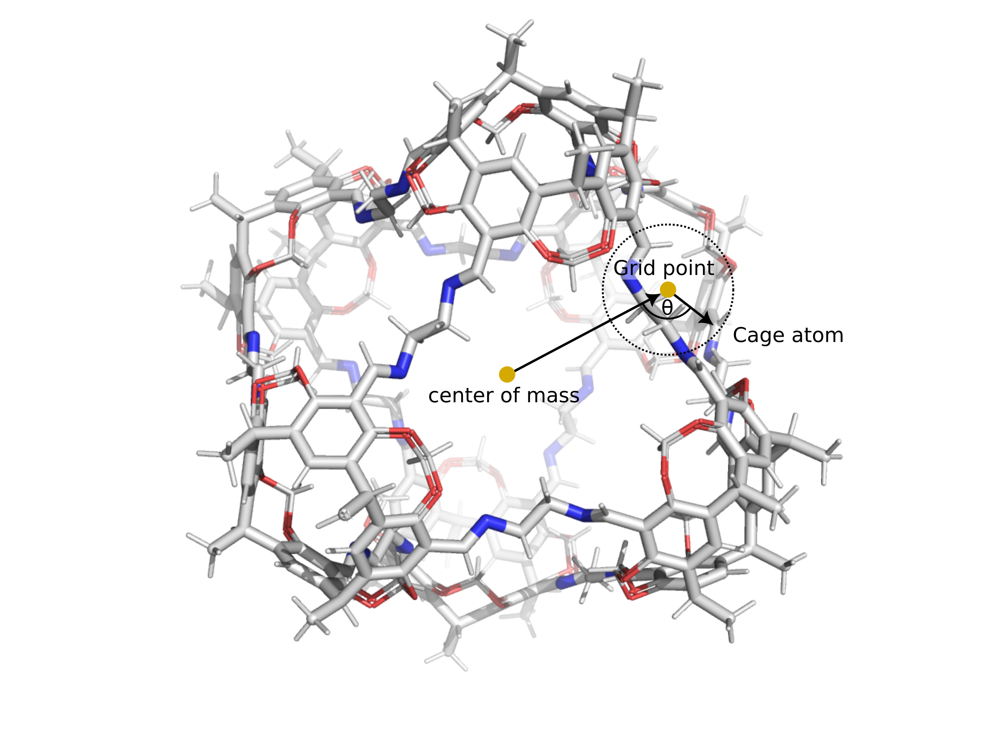

# CageCavityCalc
CageCavityCalc is a Python-based tool for calculating the cavity size of molecular cages available for Windows, MAC, and Linux. CageCavityCalc is designed for the rapid calculation of cavity sizes for a wide range of molecular structures and porous systems. CageCavityCalc has a PyMol plugin making very easy to compute and visualize the cavity through an automated graphical user interface. Additionally, CageCavityCalc can also be used by the command line and as a Python module. In addition to computing the cavity size, the hydrophobic and electrostatic potentials of the cavity are computed, providing insights into potential host-guest interactions.

## Citation
If you find CageCavityCalc useful in your research please consider citing the paper: 
Vicente Martí-Centelles, Tomasz Krzysztof Piskorz, Fernanda Duarte. CageCavityCalc (C3): A computational tool for calculating and visualizing cavities in Molecular Cages. ChemRxiv, 2024, https://doi.org/10.26434/chemrxiv-2024-fmlx0

<p align="center">
 
</p>

## Quick installation:

The installation of CageCavityCalc can be performed in Windows, Mac, or Linux. It only requires to:

Download and install Miniconda3 (https://docs.conda.io/en/latest/miniconda.html)

Open the “Anaconda Prompt” and execute the following commands:

```
pip install CageCavityCalc
conda install -c conda-forge pymol-open-source
pip uninstall pyqt5
pip install pyqt5 qtpy
conda install -c conda-forge openbabel
conda install -c conda-forge mdanalysis
pymol

Then, install the PyMol the plugin: Plugin > Plugin Manager > Install New Plugin.
Choose “Install from local file” and locate the __init__.py file in the pymol_plugin folder of C3
(typically located in C:\Users\UserName\miniconda3\Lib\site-packages\CageCavityCalc\pymol_plugin).
```


## Quick start
CageCavityCalc can be used from the PyMol plugin, throught the command line, and from a Python file by loading the CageCavityCalc module. 

### PyMol plugin
 The PyMol plugin is integrated into the software through a user interface allowing the selection of the different parameters for the cavity calculation. First, the user needs to initiate PyMol by typing “pymol” in the Anaconda Prompt. Then, in the PyMol interface the user needs to load the desired cage file using File > Open and select the “cage.pdb” file. Then, to initiate the C3 plugin, the user needs access to Plugin > CageCavityCalc. Once all the options are selected, the user needs to click on “Calculate volume” to initiate the calculation of the cavity and all the selected properties. Once the computation is finished, the computed cavity and the cavity with the properties are displayed in PyMol. The PyMol plugin enables the storage of all computed properties in the same PyMol session file, allowing the user to select which one to display and to save PDB files of each property. To save the session file, the user needs to access to File > Save Session As. The user can select the computed property to display by just clicking on the right panel of the generated cavity objects (see Figure 9 in the manuscript). To obtain a good quality image of the cage and the cavity, the user needs to type “ray” in the PyMol command line, then the obtained image can be saved by using File > Export Image As > PNG. 

<p align="center">

</p>

### Command line
For example, to use C3 from the command line the user needs to executee in the console the following commands: $python CageCavityCalc.py -f cage.pdb -o cage_cavity.pdb -gr 1.5. This order will load the cage.pdb file containing the cage chemical structure and the cavity of the cage will be calculated using a grid spacing of 1.5 Å. Additional arguments can be used as described in Table S1, allowing specifying the distance threshold used to calculate 90º angle, the use of the clustering algorithm to remove noisy cavity points that does not belogin to the main cavity, calculation of hydrophobicity specifying the method and distance function, calculation of hydrophobicity, save a PyMol pml file, or print additional information of the calculations in the terminal.

Arguments that can be used int the C3 Python module though the command line.
> -f	Input file (*pdb, *mol2, ...)\
> -o	Output file (*pdb, *mol2, ...). If this argument is not used, the automatic generation of output filenames is performed.\
> -gr X	Grid spacing resolution (Angstroms). Default 1.0\
> -d90a X	Automatic distance threshold to calculate 90 deg angle as X times window radius. Default 2.0. If the calculated threshold distance is smaller than 5 Å, it is set to 5 Å to ensure probe to find atoms to calculate the angle.\
> -d90m X	Manual distance threshold to calculate 90 deg angle in Å\
> -cluster false, size or dist	Remove cavity noise by dbscan clustering (size or dist)\
> -hydrophobicity or -hydro	Calculate hydrophobicity\
> -method Ghose or Crippen	Method to calculate the hydrophobicity\
> -distfun Audry, Fauchere, Fauchere2, or OnlyValues:	Method to calculate the hydrophobicity\
> -esp	Calculate the electrostatic potential\
> -charge_method	Charge method used in the ESP: eem, mmff94, gasteiger, qeq, qtpie, eem2015ha, eem2015hm, eem2015hn, eem2015ba, eem2015bm, eem2015bn. Default=eem.\
> -metal	Metal used in the ESP\
> -metal_charge	Charge of the metal used in the ESP\
> -pymol	Create PyMol pml file\
> -info	Print log INFO on the terminal\


### Python module
To use C3 as in a Python script, it is required to load the module, followed by the initialization of the cavity, load the .pdb file of the cage, followed by the cavity volume calculation (using the default values of grid spacing resolution 1 Å and distance threshold for the 90-degree calculation of 5 Å) and saving the corresponding *.pdb file and PyMol *.pml file for cavity visualization in PyMol.

```
from CageCavityCalc.CageCavityCalc import cavity
cav = cavity()
cav.read_file("cage.pdb")
volume = cav.calculate_volume()
cav.print_to_file("cage_cavity.pdb")
cav.print_to_pymol("cage_cavity.pml")
print("Cavity_volume= ", volume, " A3")
```


## Python module  additional examples
CageCavityCalc, as a Python module, integrates well with more complex programs. We provide several examples showcasing its core functionalities and the types of analyses achievable.

### Example 1
Here we provide a more complex example to show additional functionality of C3. In the example below it is loaded the cage.pdb file, then the cavity is computed using a grid spacing of 1.0 Å and a distance threshold for the 90-degree calculation of 2.0 times the window size. Note that this code uses the same implementation of the distance threshold for the 90-degree of the PyMol plugin. If computed window size is very small, resulting in threshold for the 90-degree smaller than 5 Å, the threshold is set to 5 Å to ensure the probe to find atoms to calculate the angle. The cavity is be saved into *.pdb file and also a PyMol *.pml file to facilitate cavity visualization in PyMol. The calculated properties can also be saved, the example below shows how to calculate the hydrophobicity and ESP and save individual *.pdb files with the hydrophobicity and ESP values stored in the B-factor, as well as PyMol *.pml files to facilitate cavity visualization with the properties in PyMol.
```
from CageCavityCalc.CageCavityCalc import cavity

cage_name = "cage"
grid_spacing = 1.0
distance_threshold_for_90_deg_angle = 2.0

cav = cavity()
cav.read_file(cage_name+".pdb")
window_radius = cav.calculate_window()
cav.distance_threshold_for_90_deg_angle = window_radius * distance_threshold_for_90_deg_angle
if cav.distance_threshold_for_90_deg_angle < 5:
    cav.distance_threshold_for_90_deg_angle = 5
cav.grid_spacing = float(grid_spacing)
cav.dummy_atom_radii = float(grid_spacing)
volume = cav.calculate_volume()
cav.print_to_file(cage_name+"_cavity.pdb")
cav.print_to_pymol(cage_name+"_cavity.pml")
cav.hydrophMethod = "Ghose" #Ghose or Crippen
cav.distance_function = "Fauchere" # Audry, Fauchere, Fauchere2, OnlyValues
cav.calculate_hydrophobicity()
cav.print_to_file(cage_name+"_cavity_hydrophobicity.pdb")
cav.print_to_pymol(cage_name+"_cavity_hydrophobicity.pml", 'h')
cav.calculate_esp() #If metals: cav.calculate_esp(metal_name="Pd", metal_charge=2)
cav.print_to_file(cage_name+"_cavity_esp.pdb")
cav.print_to_pymol(cage_name+"_cavity_esp.pml", "esp") 
print("Cavity_volume= ", volume, " A3")
```

Cavity visulaization in PyMol using the saved *.pml file.
<p align="center">

</p>
Cavity visulaization with hydrophobicity in PyMol using teh saved *.pml file.
<p align="center">

</p>

### Example 2
Read a cage class from Cgbind that enables the cage construction from a ligand smile structure, a metal, and the cage topology:

```
from CageCavityCalc.CageCavityCalc import cavity
from cgbind import Linker, Cage

linker = Linker(smiles='C1(C#CC2=CC=CC(C#CC3=CC=CN=C3)=C2)=CC=CN=C1', arch_name='m2l4')
cage = Cage(linker, metal='Pd')

cav = cavity()
cav.read_cgbind(cage)
cav.calculate_volume()
cav.print_to_file("cage_cavity.pdb")
```

### Example 3
Read MDAnalysis universe files and calculate the volume for all frames of the trajectory:
 
```
from CageCavityCalc.CageCavityCalc import cavity
import MDAnalysis

cav = cavity()

syst = MDAnalysis.Universe("short.gro", "short.xtc")

volume = []
for ts in syst.trajectory:
    cav.read_mdanalysis(syst)
    volume.append(cav.calculate_volume())

print(volume)
```

### Example 4
Read MDAnalysis universe files and calculate the volume for all frames of the trajectory. The obtained cavity volumes in all the structures of the trajectory can be saved using the following script. The number of atoms is kept constant by setting additional grid points is in existing grid point, or in case when there is no cavity it is set to (0,0,0), when necessary.

```
from CageCavityCalc.CageCavityCalc import cavity
import MDAnalysis

syst = MDAnalysis.Universe("short.gro", "short.xtc")
volume = []
max_grid = 0

for idx, ts in enumerate(syst.trajectory):
    cav = cavity()
    cav.read_mdanalysis(syst.atoms)
    volume.append(cav.calculate_volume())
    cav.print_to_file(f"cage_cavity_{idx:}.pdb")
    if len(cav.dummy_atoms_positions) > max_grid:
        max_grid = len(cav.dummy_atoms_positions)

atom_max = max_grid + cav.n_atoms

# Save as a trajectory:
FileTraj = MDAnalysis.Writer("traj.xtc")
for idx, ts in enumerate(syst.trajectory):
    syst = MDAnalysis.Universe(f"cage_cavity_{idx:}.pdb")
    n_missing = atom_max - len(syst.atoms)

    if n_missing != 0:  # save at the same position as existing grid
        positions = np.array([syst.atoms.select_atoms("name D and resname CV")[0].position] * n_missing)
    else:  # if no cavity, save it at the 0,0,0
        positions = np.zeros((n_missing, 3))

    if n_missing > 0:
        sol = MDAnalysis.Universe.empty(n_missing, trajectory=True)
        sol.add_TopologyAttr('name', ['D'] * n_missing)
        sol.add_TopologyAttr('type', ['D'] * n_missing)
        sol.add_TopologyAttr('resname', ['CV'])
        sol.atoms.positions = positions
        FileTraj.write(MDAnalysis.Merge(syst.atoms, sol.atoms).atoms)
    else:
        FileTraj.write(syst.atoms)

FileTraj.close()

```


### Other
To make the calculation loud use CAV_LOG_LEVEL environmental variable

```commandline
export CAV_LOG_LEVEL=INFO
```


## Detailed installation instructions:

The software CageCavityCalc (C3) is compatible with Linux, Windows, and Mac. The installation of C3 requires the following steps. 

First it is required to install Miniconda3 (Python 3.7 or later), that can be obtained from https://docs.conda.io/en/latest/miniconda.html. Then in the “Anaconda Prompt”, the command line version of C3 is installed using pip: “pip install CageCavityCalc”, this will install the required dependencies.

For performing ESP and hydrophobicity calculation, C3 requires OpenBabel that can be installed using “conda install -c conda-forge openbabel” (or “conda config --add channels conda-forge” followed by “conda install openbabel”). For file loading in multiple formats, including files for molecular dynamics cavity analysis, requires installing MDAnalysis using “conda install -c conda-forge mdanalysis” (or “conda config --add channels conda-forge” followed by “conda install mdanalysis”). 

As with any program, to run CageCavityCalc from the command line it is needed to either add its installation folder to the system path or to execute the CageCavityCalc.py file directly from the folder. For example, in Windows the user needs to add the folder “C:\Users\UserName\miniconda3\Lib\site-packages\CageCavityCalc\” to the Python path navigating through the following menus: My Computer > Properties > Advanced System Settings > Environment Variables > PYTHONPATH.

To install the C3 PyMol plugin, the open-source version of PyMol must be installed in the “Anaconda Prompt” the command using “conda install -c conda-forge pymol-open-source” for Windows, Mac, and Linux. Alternatively, it can be installed from https://www.cgohlke.com/ for Windows. It is also required to install the following dependencies: “pip install pyqt5 qtpy” (in some cases it may require uninstall pyqt5 with “pip uninstall pyqt5” followed by “pip install pyqt5 qtpy”). For Spanish computers, for running the plugin it is required to change the regional settings of the computer to use points as a decimal separator instead of commas.
Once PyMol is installed, in PyMol the plugin is installed from: Plugin > Plugin Manager > Install New Plugin. Choose “Install from local file” and locate the __init__.py file in the pymol_plugin folder of C3 typically located in C:\Users\UserName\miniconda3\Lib\site-packages\CageCavityCalc\pymol_plugin. To use the plugin, the user just needs to open a cage in PyMol, then go to Plugin and click on CageCavityCalc to run the plugin.  Then, the computed cavity is displayed in PyMol. The user can select the computed property to display by just clicking on the right panel of the generated cavity objects.

## How it works

CageCavityCalc relies on a geometric algorithm that utilizes an angle measurement technique. The following image illustrates the key parameters involved in calculating the angle that defines cavity boundaries.
<p align="center">
 
</p>


